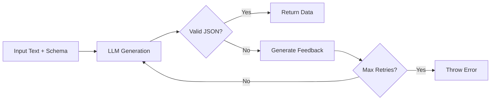

<!-- README.md is generated from README.Rmd. Please edit that file -->

# instructoR 

<!-- badges: start -->

[](https://github.com/SkanderMulder/extractoR/actions/workflows/r.yml)
[](https://lifecycle.r-lib.org/articles/stages.html#experimental)
[](https://opensource.org/licenses/MIT)
[](https://skandermulder.r-universe.dev/instructoR)
<!-- badges: end -->

> **Self-Correcting Structured Data Extraction from Text Using Large
> Language Models**

**instructoR** is an R package that automatically validates and corrects
LLM outputs against your schema. Inspired by Python’s
[instructor](https://github.com/jxnl/instructor) and
[outlines](https://github.com/outlines-dev/outlines), it eliminates the
pain of malformed JSON and schema violations through intelligent
self-correction.

**Stop fighting with LLM outputs. Get guaranteed valid data or
controlled failure.**

## Why instructoR?

When working with LLMs for data extraction, you typically face:

  - **Malformed JSON** that breaks `jsonlite::fromJSON()`
  - **Schema violations** like wrong types or missing fields
  - **Manual retry logic** with hacky error handling
  - **Unreliable parsing** that fails in production

instructoR solves this by:

1.  Converting R schemas to JSON Schema automatically
2.  Validating LLM responses against your schema
3.  Providing intelligent feedback to the LLM when validation fails
4.  Retrying with self-correction until success or max attempts

**Result:** Guaranteed valid output or controlled failure. No surprises.

-----

## Features

  - **Automatic Validation**: JSON Schema validation with detailed error
    reporting
  - **Self-Correction**: Intelligent retry with LLM feedback until
    success
  - **Rich Schema Support**: Enums, nested objects, arrays, and complex
    structures
  - **Local & Cloud Models**: Works with OpenAI, Anthropic, or local
    Ollama models
  - **Multiple Strategies**: Choose between reflective, direct, or
    polite correction styles
  - **Progress Tracking**: Built-in progress indicators for long
    operations
  - **Type Safety**: Native R type conversion from JSON responses
  - **Zero Configuration**: Works out of the box with sensible defaults

-----

## Installation

### From GitHub (Recommended)

``` r
# Using pak (fastest)
pak::pak("SkanderMulder/extractoR")

# Or using remotes
remotes::install_github("SkanderMulder/extractoR")

# Or using devtools
devtools::install_github("SkanderMulder/extractoR")
```

### From R-Universe

``` r
install.packages("instructoR", repos = "https://skandermulder.r-universe.dev")
```

-----

## Quick Start

### 30-Second Example

Extract structured data from unstructured text in just a few lines:

``` r
library(instructoR)

# Define what you want to extract
schema <- list(
  sentiment = c("positive", "negative", "neutral"),
  confidence = "numeric",
  keywords = list("character"),
  entities = list(list(
    name = "character",
    type = "character"
  ))
)

# Extract from text
review <- "Amazing product! Fast shipping and great customer service.
          Apple delivered another winner with the iPhone."

result <- extract(
  text = review,
  schema = schema,
  model = "gpt-4o-mini"
)

str(result)
# List of 4
#  $ sentiment : chr "positive"
#  $ confidence: num 0.95
#  $ keywords  : List of 3
#  $ entities  : List of 2
```

### Local Models with Ollama

Use local LLMs for privacy and cost savings:

``` r
# Start Ollama: ollama serve
# Pull a model: ollama pull gemma:2b

result <- extract(
  text = article_text,
  schema = schema,
  model = "ollama/gemma:2b"
)
```

See `inst/examples/ollama_example.R` for a complete working example.

-----

## Core Concepts

### Schema Definition

instructoR uses intuitive R syntax for schema definition:

Choose how the LLM receives feedback:

``` r
# Reflective: provides context and encourages reasoning
extract(text, schema, strategy = "reflect")

# Direct: concise error feedback
extract(text, schema, strategy = "direct")

# Polite: friendly tone for models that respond well to courtesy
extract(text, schema, strategy = "polite")
```

### Advanced Schema Patterns

Build complex, production-ready schemas:

``` r
schema <- list(
  # Enums (controlled vocabularies)
  status = c("draft", "published", "archived"),

  # Basic types
  title = "character",
  views = "integer",
  rating = "numeric",
  is_featured = "logical",

  # Arrays
  tags = list("character"),

  # Nested objects
  author = list(
    name = "character",
    email = "character"
  ),

  # Arrays of objects
  comments = list(list(
    user = "character",
    text = "character",
    timestamp = "character"
  ))
)
```

### Progress Tracking

Monitor extraction with built-in progress indicators:

``` r
extract(text, schema, .progress = TRUE)
# ── Starting Extraction ──────────────────────────
# ℹ Model: gpt-4o-mini
# ℹ Max retries: 5
# ℹ Strategy: reflect
# ℹ Sending initial request to LLM...
# ℹ Received initial response. Validating...
# ✔ Extraction successful after 1 attempts.
```

-----

## Use Cases

instructoR excels at extracting structured information from various
domains:

## Real-World Examples

### Academic Paper Metadata

``` r
paper_schema <- list(
  title = "character",
  authors = list("character"),
  year = "integer",
  abstract = "character",
  topics = list("character"),
  methodology = c("qualitative", "quantitative", "mixed"),
  is_open_access = "logical"
)

extract(paper_text, paper_schema, model = "gpt-4o-mini")
```

### Product Review Analysis

``` r
review_schema <- list(
  overall_sentiment = c("positive", "negative", "neutral"),
  rating_estimate = "integer",
  pros = list("character"),
  cons = list("character"),
  mentioned_features = list(list(
    feature = "character",
    sentiment = c("positive", "negative", "neutral")
  ))
)

extract(review_text, review_schema, model = "gpt-4o-mini")
```

### Clinical Notes Extraction

``` r
clinical_schema <- list(
  patient_age = "integer",
  chief_complaint = "character",
  symptoms = list("character"),
  diagnoses = list(list(
    condition = "character",
    icd_code = "character",
    confidence = c("definite", "probable", "possible")
  )),
  medications = list(list(
    name = "character",
    dosage = "character",
    frequency = "character"
  ))
)

extract(clinical_note, clinical_schema, model = "gpt-4o-mini")
```

-----

## How It Works

instructoR implements a validation-correction loop:



### Process Steps

1.  **Schema Conversion**: R list → JSON Schema
2.  **Initial Request**: LLM receives text and schema requirements
3.  **Validation**: `jsonvalidate` checks response against schema
4.  **Self-Correction**: On failure, LLM receives error details and
    retries
5.  **Guaranteed Output**: Valid data returned or controlled error
    thrown

## Comparison with Alternatives

| Feature             | instructoR | Manual Parsing | Python instructor |
| ------------------- | ---------- | -------------- | ----------------- |
| Automatic retry     | ✓          | ✗              | ✓                 |
| Schema validation   | ✓          | ✗              | ✓                 |
| Native R types      | ✓          | Partial        | ✗                 |
| Local models        | ✓          | ✓              | ✓                 |
| Zero dependencies\* | ✓          | ✓              | ✗                 |

\*Minimal dependencies: only essential R packages

-----

## Configuration

### API Setup

instructoR works with any LLM supported by
[ellmer](https://github.com/hadley/ellmer):

``` r
# Option 1: Environment variables (recommended)
# Add to .Renviron:
ANTHROPIC_API_KEY="your-key-here"
OPENAI_API_KEY="your-key-here"

# Option 2: Set in R session
Sys.setenv(ANTHROPIC_API_KEY = "your-key-here")
```

### Advanced Options

``` r
result <- extract(
  text = text,
  schema = schema,
  model = "gpt-4o-mini",    # Model selection
  max_retries = 10,         # Retry limit (default: 5)
  temperature = 0.0,        # Sampling temperature (default: 0.0)
  strategy = "reflect",     # Correction strategy
  .progress = TRUE          # Show progress
)
```

### Recommended Settings

| Use Case        | Model           | Strategy | Max Retries | Temperature |
| --------------- | --------------- | -------- | ----------- | ----------- |
| Production      | gpt-4o-mini     | direct   | 5           | 0.0         |
| Complex schemas | gpt-4o          | reflect  | 10          | 0.0         |
| Local/private   | ollama/gemma:2b | polite   | 3           | 0.0         |
| Experimentation | gpt-3.5-turbo   | direct   | 3           | 0.2         |

-----

## Documentation

### Getting Started

  - **Vignette**: `vignette("getting-started", package = "instructoR")`
  - **Function Reference**: `?extract`, `?as_json_schema`
  - **Ollama Example**: `inst/examples/ollama_example.R`

### Resources

  - [GitHub Repository](https://github.com/SkanderMulder/extractoR)
  - [Issue Tracker](https://github.com/SkanderMulder/extractoR/issues)
  - [Changelog](NEWS.md)

-----

## Performance Tips

1.  **Use appropriate models**: Smaller models for simple schemas,
    larger for complex reasoning
2.  **Set temperature = 0.0**: For deterministic, reproducible outputs
3.  **Choose the right strategy**: `direct` is faster, `reflect` is more
    thorough
4.  **Limit retries**: 3-5 retries is usually sufficient
5.  **Test schemas**: Verify with sample data before production use
6.  **Use Ollama for privacy**: Keep sensitive data on your
    infrastructure

-----

## Comparison with Alternatives

| Feature              | instructoR | Manual Parsing | JSON Mode | Python instructor |
| -------------------- | ---------- | -------------- | --------- | ----------------- |
| Automatic validation | ✅          | ❌              | ❌         | ✅                 |
| Self-correction      | ✅          | ❌              | ❌         | ✅                 |
| Native R types       | ✅          | Partial        | ❌         | ❌                 |
| Local models         | ✅          | ✅              | ✅         | ✅                 |
| Schema flexibility   | ✅          | ❌              | Limited   | ✅                 |
| Zero config          | ✅          | ❌              | ❌         | ❌                 |

-----

## Roadmap

  - \[ \] Support for optional fields in schemas
  - \[ \] Streaming extraction for large documents
  - \[ \] Batch processing utilities
  - \[ \] Schema inference from examples
  - \[ \] Integration with more LLM providers
  - \[ \] Performance benchmarks

-----

## Contributing

We welcome contributions\! Please:

1.  Fork the repository
2.  Create a feature branch (`git checkout -b feature/amazing-feature`)
3.  Make your changes with tests
4.  Run `devtools::check()` to ensure quality
5.  Submit a Pull Request

See [CONTRIBUTING.md](CONTRIBUTING.md) for detailed guidelines.

-----

## Citation

If you use instructoR in your research, please cite:

``` bibtex
@software{instructor_r,
  author = {Mulder, Skander Tahar},
  title = {instructoR: Self-Correcting Structured Extraction with LLMs in R},
  year = {2025},
  url = {https://github.com/SkanderMulder/extractoR}
}
```

-----

## License

MIT License - see [LICENSE.md](LICENSE.md) for details.

-----

## Acknowledgments

**Built with:** - [ellmer](https://github.com/hadley/ellmer) - R
interface to LLMs -
[jsonvalidate](https://github.com/ropensci/jsonvalidate) - JSON Schema
validation - [jsonlite](https://github.com/jeroen/jsonlite) - JSON
parsing

**Inspired by:** - [instructor](https://github.com/jxnl/instructor) -
Python structured outputs -
[outlines](https://github.com/outlines-dev/outlines) - Python structured
generation - [Pydantic](https://github.com/pydantic/pydantic) - Data
validation

**Special thanks** to the R community and all contributors.

-----

<div data-align="center">

<sub>Built with ❤️ for the R community</sub>

</div>
